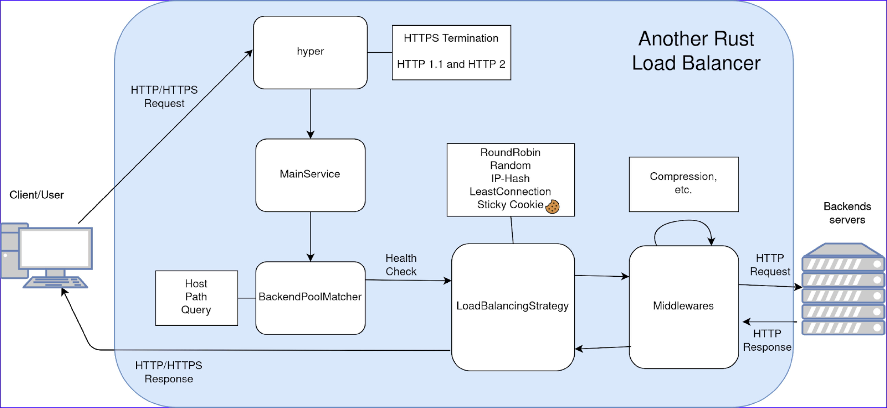

# Architecture

# Accepting Connections

Our core architecture builds upon `tokio` & `hyper`. An connection is accepted on two TCP listeners:

- On port 80, a simple `tokio::net::tcp::listener` is used to accept incoming `TcpStream`s.
- On port 443, a `tokio::net::tcp::listener` is used in combination with `tokio_rustls::TlsAcceptor`, which yields a `TlsStream<TcpStream>`.

Both types are then wrapped in a `HyperAcceptor`, which makes sure that `hyper` understands how to read from those streams (by implementing `hyper::server::accept::Accept`).

# Handling Requests

`hyper` takes care of HTTPS termination and supporting/abstracting HTTP 1.1/HTTP 2 requests. Our `MainService` takes over and executes the following tasks in order:

1. **Find a matching backend pool**
   > Each pool needs to have a `matcher`. This matcher specifies if an incoming request should be forwarded to this pool. Internally, it is represented as a recursive enum `BackendPoolMatcher`. Externally, it is supplied via config value and is parsed using an parsing expression grammar. One can specify arbitrary long matching clauses combinging && and || directives.
   > Simple: `Host('whoami.localhost')`
   > Advanced: `(Host('whoami.localhost') && Path('/')) || (Host('youtube.localhost') && Path('/admin'))`
   >
   > Also, since HTTP & HTTPS endpoints share the same `MainService`, the pool is checked if it allows the incoming scheme.
   >
   > If no matching pool is found, a `404 Not Found` will be returned
2. **Filter healthy addresses of the pool**
   > The list of backend addresses of the pool is filtered to include only healthy addresses. If no healthy backend addresses are found, a bad gateway error is returned.
3. **Execute the pool's load balancing strategy**
   > The load balancing strategy is called via trait `LoadBalancingStrategy`. It will receive all current healthy backend addresses and the client's socket address and has to return an address to forward the request to. This is also considered the start of the backend request/response chain. After all middlewares and the backend response are processed, the strategy could still modify the response before handing it to the client. (Needed for `StickyCookie`)
4. **Execute the pool's middlewares**
   > In the order specified in the config, all middlewares are executed. Middlewares can alter the request to the backend server and the received backend response before its handed to the client. It's implemented via a linked list `MiddlewareChain`. As soon as the linked list is at the end, the request will be sent to the backend server and it's response will travel back the chain.
5. **Send the response to the client**
   > Once the response from the backend server traveled back the chain of middlewares and the load balacing strategy, it will be sent to the user.
